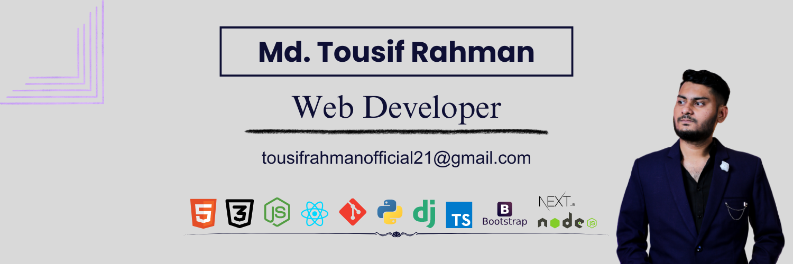

## Hi there 👋, Nice to See You  

 

# Current Overview

💻Currently working as freelance Web Developer in Fiverr Marketplace💻    
🎓 Recent BSc graduate in Computer Science and Engineering from Port City International University. 🎓  👩‍💻 MERN stack developer with a passion for building interactive and user-friendly web applications. 👩‍💻  💡 Always eager to learn and explore new technologies to stay ahead in the rapidly evolving world of web development. 💡  🌟 Completed a comprehensive web development course at Programming Hero, honing my skills and gaining practical experience. 🌟  🚀 I love turning ideas into reality through clean, efficient, and scalable code. Let's collaborate and build something amazing together!   🌱 Currently, I'm actively seeking new opportunities to contribute to exciting projects and grow as a developer. 🌱  📫 You can reach me at tousifrahmanofficial21@gmail.com. Let's connect and share our knowledge! 📫  🌐 Check out my portfolio website to see some of my recent projects and learn more about my skills and experiences: https://tousifrahman.netlify.app/ 🌐
 

## 🌐 Socials

    

# 💻 Tech Stack:

                   

<!-- Proudly created with GPRM ( https://gprm.itsvg.in ) -->

# 📊 GitHub Stats

    

 

# 📈 Statistics

## 🏆 GitHub Trophies

### ✍️ Random Dev Quote

### 📓 Dev Card

### 🔝 Top Contributed Repo

---

